# 幕境 (MuJing) - AI 上下文文档

> 最后更新：2026-04-11
> 文档版本：1.4.0
> 项目版本：v2.12.3

## 项目愿景

幕境是一款通过**真实语境学习英语单词**的创新应用，让用户在电影、美剧或文档的原汁原味的情境中记忆词汇，大幅提升学习效率。

### 核心理念
- **情境记忆**：每个单词都来自真实影视内容或文档的语境
- **多感官学习**：结合视听、拼写、抄写和听写，全方位强化记忆
- **个性化词库**：从用户喜欢的内容生成专属词库
- **智能复习**：基于 FSRS (Free Spaced Repetition Scheduler) 算法的间隔重复系统

## 架构总览

### 技术栈
- **语言**：Kotlin 2.2.21 (JVM)
- **UI 框架**：JetBrains Compose Multiplatform 1.9.3
- **桌面框架**：Compose Desktop (Java Swing interop)
- **视频播放**：VLCJ (VLJC 4.11.0) - VLC 媒体框架的 Java 绑定
- **构建工具**：Gradle 8.x (Kotlin DSL)
- **数据库**：SQLite 3.44.1.0
- **跨平台**：Windows / macOS / Linux

### 核心依赖
```kotlin
// UI & 桌面
compose.desktop.currentOs
org.jetbrains.compose.material:material-icons-extended:1.0.1
com.formdev:flatlaf:3.6.1  // Swing Look & Feel

// 依赖注入
io.insert-koin:koin-core:4.0.4  // Koin DI 框架

// 媒体处理
uk.co.caprica:vlcj:4.11.0  // VLC Java 绑定
net.bramp.ffmpeg:ffmpeg:0.8.0  // FFmpeg 包装器

// 数据处理
org.apache.pdfbox:pdfbox:2.0.24  // PDF 处理
org.apache.poi:poi:5.4.1  // Office 文档
org.apache.opennlp:opennlp-tools:1.9.4  // NLP 分句

// 网络通信
io.ktor:ktor-client-core:2.3.13  // HTTP 客户端
io.ktor:ktor-client-cio:2.3.11   // Ktor CIO 引擎

// 本地库 (JNI)
files("lib/ebml-reader-0.1.1.jar")  // MKV 解析
files("lib/subtitleConvert-1.0.3.jar")  // 字幕转换
files("lib/jacob-1.20.jar")  // Windows COM 桥接
rust-zstd-jni  // Rust 实现的 zstd JNI 绑定
```

## 模块结构图

```mermaid
graph TD
    A["(根) 幕境 MuJing"] --> B["src/main/kotlin/com/mujingx"];
    A --> C["src/test/kotlin/com/mujingx"];
    A --> D["resources"];
    A --> E["rust-zstd-jni"];
    A --> F["RemoveConfig"];

    B --> B1["data - 数据模型与词典"];
    B --> B2["ui - 用户界面"];
    B --> B3["player - 媒体播放器"];
    B --> B4["fsrs - 间隔重复系统"];
    B --> B5["tts - 文字转语音"];
    B --> B6["ffmpeg - 视频处理"];
    B --> B7["lyric - 歌词/字幕处理"];
    B --> B8["state - 应用状态管理"];
    B --> B9["event - 事件总线"];
    B --> B10["theme - 主题配置"];
    B --> B11["icons - 图标资源"];
    B --> B12["di - 依赖注入"];
    B --> B13["translation - AI 翻译"];
    B --> B14["i18n - 国际化"];
    B --> B15["subtitle - 字幕同步"];

    B2 --> B2a["components - UI 组件"];
    B2 --> B2b["dialog - 对话框"];
    B2 --> B2c["edit - 词库编辑"];
    B2 --> B2d["search - 单词搜索"];
    B2 --> B2e["subtitlescreen - 字幕浏览"];
    B2 --> B2f["textscreen - 文档阅读"];
    B2 --> B2g["wordscreen - 单词学习"];
    B2 --> B2h["util - 工具类"];

    B3 --> B3a["danmaku - 弹幕系统"];
    B3 --> B3b["播放器核心组件"];

    B4 --> B4a["apkg - Anki 卡片导入/导出"];
    B4 --> B4b["zstd - 压缩算法 JNI"];

    B12 --> B12a["AppModule - 核心服务"];
    B12 --> B12b["TranslationModule - 翻译服务"];
    B12 --> B12c["ClipModule - 片段服务"];
    B12 --> B12d["SubtitleModule - 字幕同步"];

    B13 --> B13a["TranslationService - 翻译接口"];
    B13 --> B13b["MultiProviderService - 多 Provider 路由"];
    B13 --> B13c["TranslationCacheRepository - 翻译缓存"];
    B13 --> B13d["provider - OpenAI/有道/Azure"];

    click B1 "./src/main/kotlin/com/mujingx/data/CLAUDE.md" "查看 data 模块文档"
    click B2 "./src/main/kotlin/com/mujingx/ui/CLAUDE.md" "查看 ui 模块文档"
    click B3 "./src/main/kotlin/com/mujingx/player/CLAUDE.md" "查看 player 模块文档"
    click B4 "./src/main/kotlin/com/mujingx/fsrs/CLAUDE.md" "查看 fsrs 模块文档"
    click B5 "./src/main/kotlin/com/mujingx/tts/CLAUDE.md" "查看 tts 模块文档"
    click B6 "./src/main/kotlin/com/mujingx/ffmpeg/CLAUDE.md" "查看 ffmpeg 模块文档"
    click B7 "./src/main/kotlin/com/mujingx/lyric/CLAUDE.md" "查看 lyric 模块文档"
    click B8 "./src/main/kotlin/com/mujingx/state/CLAUDE.md" "查看 state 模块文档"
    click B9 "./src/main/kotlin/com/mujingx/event/CLAUDE.md" "查看 event 模块文档"
    click B10 "./src/main/kotlin/com/mujingx/theme/CLAUDE.md" "查看 theme 模块文档"
```



## 模块索引

| 模块路径 | 职责描述 | 主要技术 | 入口文件 | 文档状态 |
|---------|---------|----------|---------|---------|
| **[data](./src/main/kotlin/com/mujingx/data/)** | 数据模型、词典、词库、片段管理 | Kotlin Serialization, SQLite | `Vocabulary.kt`, `Dictionary.kt`, `Clip.kt`, `ClipService.kt` | ✅ 完整 |
| **[ui](./src/main/kotlin/com/mujingx/ui/)** | 用户界面、交互逻辑 | Compose Desktop, FlatLaf | `App.kt`, `WordScreen.kt` | ✅ 完整 |
| **[player](./src/main/kotlin/com/mujingx/player/)** | 视频播放器、弹幕系统 | VLCJ, Compose Canvas | `VidePlayer.kt`, `danmaku/` | ✅ 完整 |
| **[fsrs](./src/main/kotlin/com/mujingx/fsrs/)** | 间隔重复算法、Anki 集成 | FSRS 算法, zstd 压缩 | `FSRSService.kt`, `apkg/` | ✅ 完整 |
| **[tts](./src/main/kotlin/com/mujingx/tts/)** | 文字转语音服务 | Azure TTS, macOS TTS, Windows TTS | `MSTTSpeech.kt` | ✅ 完整 |
| **[ffmpeg](./src/main/kotlin/com/mujingx/ffmpeg/)** | 视频片段提取 | FFmpeg | `FFmpegUtil.kt` | ✅ 完整 |
| **[lyric](./src/main/kotlin/com/mujingx/lyric/)** | 歌词/字幕解析 | LRC 格式 | `Lyric.kt`, `SongLyric.kt` | ✅ 完整 |
| **[state](./src/main/kotlin/com/mujingx/state/)** | 应用状态管理 | Kotlin State | `AppState.kt`, `GlobalState.kt` | ✅ 完整 |
| **[event](./src/main/kotlin/com/mujingx/event/)** | 事件总线、快捷键 | Kotlin Flow | `EventBus.kt`, `WindowKeyEvent.kt` | ✅ 完整 |
| **[theme](./src/main/kotlin/com/mujingx/theme/)** | 主题配置、颜色方案 | Compose Material | `colors.kt`, `CustomLocalProvider.kt` | ✅ 完整 |
| **[di](./src/main/kotlin/com/mujingx/di/)** | Koin 依赖注入模块定义 | Koin 4.x | `AppModule.kt`, `TranslationModule.kt`, `ClipModule.kt`, `SubtitleModule.kt` | 🆕 新增 |
| **[translation](./src/main/kotlin/com/mujingx/translation/)** | AI 翻译服务、多 Provider 路由、翻译缓存 | Ktor, SQLite, kotlinx.serialization | `TranslationService.kt`, `MultiProviderTranslationService.kt` | 🆕 新增 |
| **[i18n](./src/main/kotlin/com/mujingx/i18n/)** | 国际化运行时、字符串资源管理 | Compose, JSON | `I18n.kt` | 🆕 新增 |
| **[subtitle](./src/main/kotlin/com/mujingx/subtitle/)** | 字幕同步精度（全局偏移+逐句微调） | SQLite, 内存缓存 | `SubtitleSyncService.kt`, `SubtitleSyncServiceImpl.kt` | 🆕 新增 |
| **[rust-zstd-jni](./rust-zstd-jni/)** | Rust JNI zstd 压缩库 | Rust, JNI | `src/lib.rs` | ⚠️ 可选 |

## 运行与开发

### 环境要求
- **JDK**：21+ (推荐使用 Eclipse Temurin 或 Oracle JDK)
- **Kotlin**：2.2.21
- **Gradle**：8.x (项目包含 Gradle Wrapper)
- **Rust** (可选)：如需构建 zstd JNI 库
- **FFmpeg**：macOS/Linux 需要系统安装或使用内置版本

### 构建项目
```bash
# 首次构建（解压词典、准备 FFmpeg）
./gradlew compileKotlin

# 完整构建
./gradlew build

# 运行应用
./gradlew run

# 运行测试
./gradlew test

# 打包分发版
./gradlew packageDmg        # macOS
./gradlew packageMsi        # Windows
./gradlew packageDeb        # Linux
```

### 开发配置
```bash
# IDE：IntelliJ IDEA (推荐) 或 Android Studio
# 1. 打开项目根目录
# 2. 等待 Gradle 同步完成
# 3. 配置 Kotlin 编译器选项：-opt-in=kotlin.RequiresOptIn
# 4. 运行 Main.kt 或使用 Gradle 任务
```

### JVM 参数配置
应用已针对性能和内存优化：
```bash
-server -Xms64m -Xmx1g -XX:+UseZGC -XX:+ZGenerational
-Dcompose.swing.render.on.graphics=true
-Dcompose.interop.blending=true
```

## 测试策略

### 测试框架
- **JUnit 5**：单元测试和集成测试
- **Compose UI Testing**：UI 组件测试
- **测试资源**：`src/test/resources/whisper/` (Whisper 模型文件)

### 测试分类
```bash
# 标准单元测试（排除 UI 测试）
./gradlew test

# UI 测试（需显示环境）
./gradlew testUi

# 特定模块测试
./gradlew test --tests "*FSRS*"
./gradlew test --tests "*Dictionary*"

# 特定对话框测试
./gradlew testUi --tests "*SettingsDialog*"
```

### 测试覆盖
- ✅ **FSRS 算法**：完整测试套件（业务逻辑、参数、性能、边缘情况）
- ✅ **Anki 导入/导出**：完整测试
- ✅ **词典查询**：单元测试
- ✅ **字幕解析**：功能测试
- ✅ **SettingsDialog**：完整 UI 测试（10/10 通过，100% 覆盖率）
- ✅ **AI 翻译服务**：TranslationServiceTest（3 tests），TranslationCacheRepositoryTest（4 tests）
- ✅ **片段管理**：ClipRepositoryTest（2 tests）
- ✅ **字幕同步**：SubtitleSyncServiceTest（5 tests）
- ⚠️ **其他 UI 组件**：部分覆盖（需要显示环境）
- ⚠️ **播放器集成**：手动测试（需要媒体文件）

## 编码规范

### Kotlin 代码风格
- 遵循 [Kotlin 官方编码规范](https://kotlinlang.org/docs/coding-conventions.html)
- 使用 `kotlin.code.style=official` (已在 gradle.properties 中配置)
- 所有实验性 API 需显式标注 `@OptIn`

### 命名约定
- **包名**：全小写，使用 `com.mujingx.*`
- **类名**：大驼峰 (PascalCase)
- **函数/变量**：小驼峰 (camelCase)
- **常量**：全大写下划线分隔 (UPPER_SNAKE_CASE)
- **私有成员**：以 `is`/`has` 开头的布尔变量

### 注释规范
- **文件头**：包含版权信息和 GPL-3.0 许可证声明
- **公共 API**：必须包含 KDoc 注释
- **复杂逻辑**：添加行内注释说明

### Git 提交规范
```
<type>(<scope>): <subject>

<body>

<footer>
```

**Type 类型：**
- `feat`：新功能
- `fix`：Bug 修复
- `docs`：文档更新
- `style`：代码格式调整
- `refactor`：重构（不改变功能）
- `test`：测试相关
- `chore`：构建/工具链更新

**示例：**
```
feat(player): 添加弹幕时间轴同步功能

实现弹幕与视频字幕的时间轴精确同步，
支持多轨道弹幕显示和交互。

Closes #123
```

## AI 使用指引

### 项目上下文重点
当使用 AI 助手（如 Claude Code）协助开发时，应重点关注以下上下文：

#### 核心业务逻辑
1. **词库生成流程**：
   - 从 MKV 视频/字幕文件/文档提取单词
   - 匹配词典获取释义、音标、例句
   - 生成 JSON 格式词库文件

2. **FSRS 学习算法**：
   - 基于遗忘曲线的间隔重复调度
   - 支持卡片难度、稳定性、记忆留存度计算
   - Anki 格式导入/导出

3. **播放器集成**：
   - VLCJ 播放器与 Compose UI 的互操作
   - 弹幕系统与字幕同步
   - 视频片段提取（FFmpeg）

#### 技术难点
1. **Compose + Swing 互操作**：
   - 使用 `Window` 和 `ComposePanel` 嵌入 Compose
   - FlatLaf 主题与 Compose 主题同步
   - 快捷键在两个框架间的传递

2. **JNI 本地库集成**：
   - Rust 实现的 zstd 压缩库
   - 通过 JNA 调用 Windows API (User32.dll)
   - Jacob 库调用 Windows COM 接口 (TTS)

3. **媒体处理**：
   - MKV 格式解析（EBML Reader）
   - 字幕格式转换 (SRT/VTT/ASS)
   - FFmpeg 视频片段提取

### 常见开发任务

#### 添加新的词库来源
1. 在 `src/main/kotlin/com/mujingx/ui/util/GenerateVocabulary.kt` 中添加解析逻辑
2. 实现单词提取和语境匹配
3. 更新 `GenerateVocabularyDialog.kt` 添加 UI 入口
4. 编写测试用例验证功能

#### 扩展播放器功能
1. 在 `src/main/kotlin/com/mujingx/player/` 中添加新组件
2. 使用 VLCJ 的 `MediaPlayer` API
3. 通过 `MediaPlayerComponent` 集成到 Compose
4. 更新 `PlayerState` 管理播放状态

#### 优化 FSRS 算法
1. 修改 `src/main/kotlin/com/mujingx/fsrs/fsrs.kt` 中的核心算法
2. 在 `FSRSService.kt` 中实现新的调度逻辑
3. 添加单元测试到 `src/test/kotlin/com/mujingx/fsrs/`
4. 更新 `FlashCardManager.kt` 中的卡片管理逻辑

#### 适配新的 TTS 服务
1. 在 `src/main/kotlin/com/mujingx/tts/` 中创建新的 TTS 实现
2. 实现 `TextToSpeech` 接口（如果存在）
3. 在 `SettingsDialog.kt` 中添加配置选项
4. 更新 `MSTTSpeech.kt` 中的 TTS 服务选择逻辑

### 调试技巧

#### 启用详细日志
```kotlin
// 在 build.gradle.kts 中添加
implementation("ch.qos.logback:logback-classic:1.5.13")

// 在代码中启用日志
import io.github.microutils.kotlinlogging.l
private val logger = l {}
logger.debug { "调试信息" }
```

#### VLCJ 调试
```bash
# 设置环境变量启用 VLC 日志
export VLC_VERBOSE=3
./gradlew run
```

#### Compose UI 调试
```kotlin
// 启用 Compose 布局检查
import androidx.compose.ui.tooling.preview.Preview

@Preview
@Composable
fun PreviewMyComponent() {
    MyComponent()
}
```

### 性能优化建议

1. **内存管理**：
   - 使用 ZGC 垃圾回收器（已配置）
   - 及时释放大型资源（视频播放器、词典数据库）
   - 使用 `LazyColumn`/`LazyRow` 实现虚拟滚动

2. **列表性能优化**（已实施）：
   - 所有 LazyColumn/LazyVerticalGrid 添加 `key` 和 `contentType` 参数
   - 使用唯一标识符（文件绝对路径、单词值、索引等）作为 key
   - 避免不必要的重组，提升滚动流畅度
   - 涉及组件：BuiltInVocabularyMenu, BuiltInVocabularyDialog,
     GenerateVocabularyDialog, LinkVocabularyDialog, SpeechDialog,
     SubtitleScreen, TextScreen

2. **视频处理优化**：
   - FFmpeg 操作在后台线程执行
   - 视频片段缓存机制
   - 预加载下一个单词的视频片段

3. **词典查询优化**：
   - SQLite 索引优化
   - 批量查询减少数据库访问
   - 缓存常用单词释义

## 相关资源

### 官方文档
- [Kotlin 文档](https://kotlinlang.org/docs/)
- [Compose Multiplatform](https://compose-multiplatform.org/)
- [VLCJ 文档](https://github.com/caprica/vlcj)
- [Gradle Kotlin DSL](https://docs.gradle.org/current/userguide/kotlin_dsl.html)

### 项目 Wiki
- [如何用 MKV 视频生成词库](https://github.com/tangshimin/MuJing/wiki/%E5%A6%82%E4%BD%95%E7%94%A8-MKV-%E8%A7%86%E9%A2%91%E7%94%9F%E6%88%90%E8%AF%8D%E5%BA%93)
- [如何用字幕生成词库](https://github.com/tangshimin/MuJing/wiki/%E5%A6%82%E4%BD%95%E7%94%A8%E5%AD%97%E5%B9%95%E7%94%9F%E6%88%90%E8%AF%8D%E5%BA%93)
- [如何用文档生成词库](https://github.com/tangshimin/MuJing/wiki/%E5%A6%82%E4%BD%95%E7%94%A8%E6%96%87%E6%A1%A3%E7%94%9F%E6%88%90%E8%AF%8D%E5%BA%93)
- [链接字幕词库](https://github.com/tangshimin/MuJing/wiki/%E9%93%BE%E6%8E%A5%E5%AD%97%E5%B9%95%E8%AF%8D%E5%BA%93)

### 外部库
- [FSRS 算法](https://github.com/open-spaced-repetition/fsrs4anki)
- [Anki](https://apps.ankiweb.net/)
- [FFmpeg](https://ffmpeg.org/)
- [VLC 媒体播放器](https://www.videolan.org/vlc/)

## 变更记录 (Changelog)

### 2026-04-11 - 功能增强：DI/翻译/i18n/片段/字幕同步 v1.4.0
- 🏗️ **P0-1 Koin DI 框架**：引入 Koin 4.0.4，仅覆盖 Service/Repository 层
  - 新增 4 个 DI 模块：AppModule、TranslationModule、ClipModule、SubtitleModule
  - Main.kt 中初始化 Koin 容器
- 🤖 **P0-2 AI 翻译功能**：多 Provider 翻译服务架构
  - TranslationService 接口 + MultiProviderTranslationService 自动 fallback 路由
  - 3 个翻译 Provider：OpenAI (GPT-4o-mini)、有道翻译 (API v3)、Azure Cognitive Services
  - SQLite 翻译缓存层，避免重复 API 调用
- 🌐 **P1-1 i18n 架构**：国际化运行时核心
  - I18n.t("key") 静态 API + Compose LocalI18n 集成
  - zh-CN.json（~50 个 key）和 en.json（占位）语言包
- 📌 **P1-2 片段管理**：数据模型和持久化层
  - Clip + ClipCollection 数据模型 + SQLite 表定义
  - ClipRepository（CRUD）+ ClipService（业务逻辑）
- ⏱️ **P1-3 字幕同步**：双层偏移机制
  - SubtitleSyncService 全局偏移 + 逐句微调接口
  - SubtitleSyncServiceImpl 内存缓存 + SQLite 持久化
- 🧪 **新增 14 个测试**：全部通过（翻译服务 3、翻译缓存 4、片段仓库 2、字幕同步 5）
- 📦 **新增依赖**：koin-core:4.0.4、ktor-client-core:2.3.13、ktor-client-cio:2.3.11
- 📝 **设计文档**：`docs/superpowers/specs/2026-04-11-mujing-feature-enhancement-design.md`
- 📋 **实施计划**：`docs/superpowers/plans/2026-04-11-mujing-feature-enhancement-plan.md`

### 2026-04-06 04:40 - 添加 UI 测试和性能优化 v1.3.0
- ✅ **UI 测试扩展**：新增 SettingsDialogTest.kt，10 个测试用例全部通过
- 🚀 **性能优化**：所有列表组件添加 key 和 contentType 参数
- 🔧 **构建配置**：添加 testUi 任务，UI 测试与单元测试分离
- 📝 **文档更新**：同步更新 UI 模块和根目录文档

### 2026-04-05 12:30 - 第三次验证完成 v1.2.0
- ✅ **第三次验证完成**：所有文档系统组件运行正常
- 📊 **文档覆盖率**：10/10 Kotlin 模块（100%），rust-zstd-jni 作为独立 Rust 子模块
- 🔍 **导航面包屑验证**：所有 10 个模块文档顶部都包含正确的导航面包屑
- 📈 **Mermaid 结构图验证**：图表完整，所有链接可点击且路径正确
- 📝 **index.json 更新**：同步最新验证结果，添加 verificationReport 字段
- 🎯 **优化改进建议**：按优先级重新组织 nextSteps 和 recommendations
- 📋 **文档健康度**：整体状态"优秀"，无重大问题

### 2026-04-05 - 增量更新文档系统 v1.1.0
- 🔄 更新文档时间戳至 2026-04-05T12:00:00Z
- ✅ 验证所有 10 个模块文档存在导航面包屑
- 📊 确认 100% 模块文档覆盖率（10/10 Kotlin 模块）
- 🔍 更新 `.claude/index.json`，添加文档路径字段
- 📝 完善模块索引表格，添加文档状态列
- ⚠️ 识别 `rust-zstd-jni` 模块缺少独立文档
- 💡 提供 6 项改进建议和下一步计划

### 2026-04-05 - 初始化 AI 上下文文档系统 v1.0.0
- 📚 创建根级 CLAUDE.md 文档
- 🗂️ 生成完整的模块结构图和索引
- 📖 添加项目愿景、架构总览、技术栈说明
- 🧪 记录测试策略和编码规范
- 🤖 添加 AI 使用指引和常见开发任务
- 🔧 提供调试技巧和性能优化建议
- 📊 统计项目规模：~200 个 Kotlin 源文件，10+ 个核心模块

---

**文档维护**：本文档应随项目演进持续更新。每次重大功能变更或架构调整后，请更新相关章节。

**AI 助手提示**：当你使用 AI 助手协助开发时，建议先提供本文档的相关章节作为上下文，以获得更准确的建议和代码生成。
